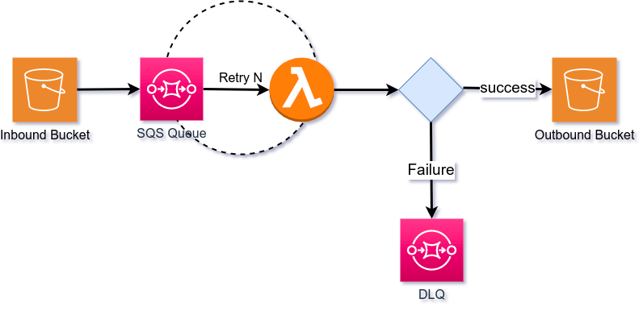

File Processing Service 
=========================

## Summary

In kidsloop2, students always upload their files into S3 as homework, which maybe lead to the leakage of sensitive personal information of students.
In order to protect the security of our users in kidsloop2, we need to hide some metadata of the files in S3 such as geographic information in students' profile,
computer names in the pdf files and etc.

To protect users' sensitive information, we can postpone hide the metadata when the users upload the files.
For example when a student has uploaded his profile, his profile hasn't changed yet.
He should click a save button to save his change. We can do the hide work when the student save his change.

The process of the solution is when after the user click the upload file, front-end program send the request for the signed url for S3
and upload the file via the signed url. Currently the file is S3 contains the sensitive metadata.
However the uploaded file hasn't record in the database, we can't access it via Kidsloop2.
We add some code in the save process in the back-end service to hide the sensitive metadata.
When the user click the save button, we save the change while access S3 for the file, hide the sensitive metadata and overwrite it into S3.

The file processing will take a lot of time. So we deploy a lambda "**kidsloop-file-processing-service**" to do the job.
Kidsloop-file-processing-service is an AWS lambda function to handle file in order to remove metadata (more functionality could be implemented in the future).
This lambda is automatically triggered by the file upload which processes files asynchronously. Any errors will retry a preconfigured number of times,
being sent to the DLQ (Dead Letter Queue) all the retries were to fail.

1. File is uploaded to the inbound S3 bucket

2. The upload automatically triggers a message to the SQS queue

3. The Lambda is configured to watch all queue messages and executes the FPS functionality for each of them

4. The Lambda retries execution a pre-configured number of times

5. If all retries fail the message will be sent to the dead letter queue (DLQ)

6. If the process executes successfully the file will be transferred to the outbound S3 bucket

---
**NOTE**
lambda has soft limits which differ according to region Lambda quotas - AWS Lambda  Typically 1,000 concurrency, 10X concurrency request/second
---
## File Type Support 

| Processor | File extensions | Note             |
| -- | --------------- | ---------------- |
| exif | jpg, jpeg, mp3, mp4, mov, ooxml  | Remove meta data |

## Deploy

kidsloop-file-processing-service needs the environment as follows：

| Key          | Value                    |
|--------------|--------------------------|
| **Memory**   | 512MB                    |
| **Software** | exiftool 12.30 or higher |

kidsloop-file-processing-service relies on AWS SQS for processing reliability and error handling

kidsloop-file-processing-service needs [ExifTool](https://www.sno.phy.queensu.ca/~phil/exiftool/) to be installed.

On Ubuntu, you can install **ExifTool** via: `sudo apt-get install exiftool`

## Configuration

You can configure the tool via environment variables, environment variables definition is as follows:

| **Key**            | **NULL** | **Note**                                             |
|--------------------| -------- |------------------------------------------------------|
| storage_driver     | N        | storage dirver, now it must be "s3"                  |
| storage_accelerate | N        | storage support accelerate                           |
| storage_bucket     | N        | storage inbound bucket                               |
| storage_bucket_out | N        | storage outbound bucket                              |
| storage_region     | N        | storage region                                       |
| log_level          | N        | log level, default "debug"                           |
| log_std_out        | N        | service print logs in stdandard output               |

## Lambda Docs

Solution documented here https://calmisland.atlassian.net/wiki/spaces/BTS/pages/2546204686/OC+File+Processing+Service?focusedCommentId=2559180847#POC

## Lambda Test

This version includes at least one test for all the file types supported 

Instructions to test this version as lambda:

1. Install aws sam cli https://docs.aws.amazon.com/serverless-application-model/latest/developerguide/serverless-sam-cli-install.html
2. export the AWS credentials environment variables `AWS_ACCESS_KEY_ID` and `AWS_SECRET_ACCESS_KEY`
3. build the app `go build -o deploy/handler -ldflags "-X gitlab.badanamu.com.cn/calmisland/kidsloop-file-processing-service/constant.GitHash=$(git rev-list -1 HEAD) -X gitlab.badanamu.com.cn/calmisland/kidsloop-file-processing-service/constant.BuildTimestamp=$(date +%s)"`
4. build sam image `sam build`
5. run the image `sam local invoke  -e test-data/event.json`

The sam template (`/template.yaml`) contains the runtime configuration. 
The even (`event.json`) is a mock of the event sent from S3 to SQS which triggers the lambda. The file on this event has to be previously uploaded and present in the S3 bucket
