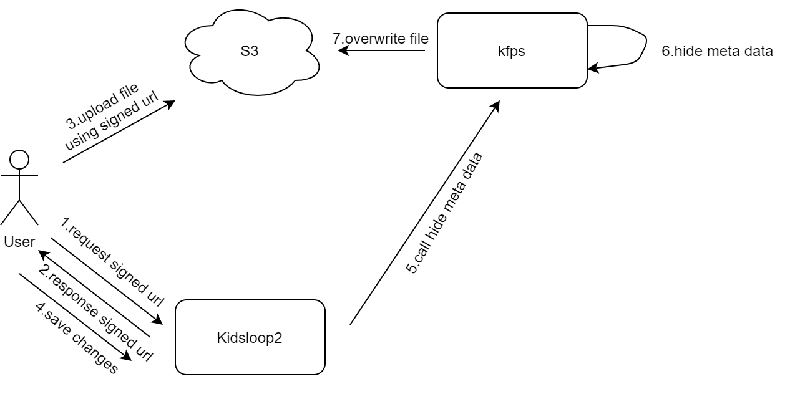
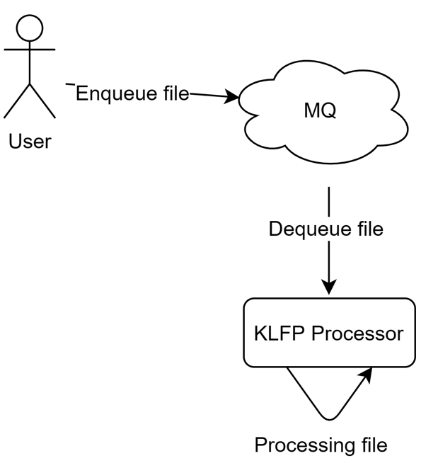
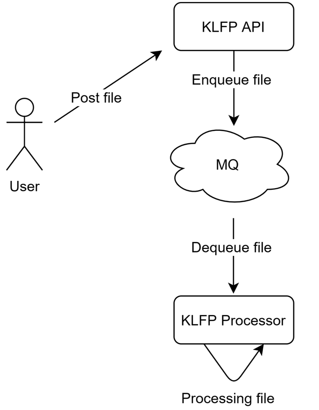

# Summary

​	In kidsloop2, students always upload their files into S3 as homework, which maybe lead to the leakage of sensitive personal information of students. In order to protect the security of our users in kidsloop2, we need to hide some metadata of the files in S3 such as geographic information in students' profile, computer names in the pdf files and etc.

​	To protect users' sensitive information, we can postpone hide the metadata when the users upload the files. For example when a student has uploaded his profile, his profile hasn't changed yet. He should click a save button to save his change. We can do the hide work when the student save his change.



​	The process of the solution is when after the user click the upload file, front-end program send the request for the signed url for S3 and upload the file via the signed url. Currently the file is S3 contains the sensitive metadata. However the uploaded file hasn't record in the database, we can't access it via Kidsloop2. We add some code in the save process in the back-end service to hide the sensitive metadata. When the user click the save button, we save the change while access S3 for the file, hide the sensitive metadata and overwrite it into S3.

​	The file processing will take a lot of time. So we deploy a brand new service "**kidsloop-file-processing-service**" to do the job. Kidsloop-file-processing-service is a web service to handle file like remove meta data, file watermark. It read pending file from MQ, and process files asynchronously. As well it can show the working thread count, error files and etc.

# Support processor

| Processor  | File extensions | Note             |
| ---------- | --------------- | ---------------- |
| attachment | jpg, jpeg, mp3, mp4, mov  | Remove meta data |


# Deploy

​	kidsloop-file-processing-service needs the environment as follows：

| Key          | Value                                            |
| ------------ | ------------------------------------------------ |
| **OS**       | Linux 4.19 or higher                             |
| **CPU**      | 2.10 GHz and more than 1 cores                   |
| **RAM**      | 4GB or more                                      |
| **ROM**      | 50GB or more                                     |
| **Software** | Golang 1.16 or higher,  exiftool 12.30 or higher |
| **Service**  | Redis 6.2.4 or higher                            |

​	kidsloop-file-processing-service needs a MQ engine. Now the only supported MQ engine is Redis. We plan to support more MQ engine but for now redis is the only supported MQ.

​	kidsloop-file-processing-service needs [ExifTool](https://www.sno.phy.queensu.ca/~phil/exiftool/) to be installed.

​	On Ubuntu, you can install **ExifTool** via: `sudo apt-get install exiftool`

## Steps

​	The steps required to deploy kidsloop-file-processing-service are as follows：

1. Clone the service repo from gitlab, url:[https://gitlab.badanamu.com.cn/calmisland/kidsloop-file-processing-service/-/tree/main](https://gitlab.badanamu.com.cn/calmisland/kidsloop-file-processing-service/-/tree/main).
1. Compile the source code, using `go build` command.
1. Add settings file "settings.yaml" in the repo path.
1. Run kidsloop-file-processing-service, using `./kidsloop-file-processing-service`.

## Settings

​	Before we run the service, "settings.yaml" must be added in the same directory. "settings.yaml" file sets the infomation of S3 bucket we used and mq config and etc. The complete definition is as follows:

| **Group** | **Key**                  | **NULL** | **Note**                                               |
| --------- | ------------------------ | -------- | ------------------------------------------------------ |
| storage   | driver                   | N        | storage dirver, now it's must be "s3"                  |
|           | accelerate               | N        | storage support accelerate                             |
|           | bucket                   | N        | storage bucket                                         |
|           | region                   | N        | storage region                                         |
|           | secret_id                | N        | storage secret id                                      |
|           | secret_key               | N        | storage secret key                                     |
| mq        | driver                   | N        | mq driver, now it's must be "redis"                    |
|           | redis_host               | N        | redis host                                             |
|           | redis_port               | N        | redis port                                             |
|           | redis_password           | N        | redis password                                         |
|           | redis_failed_persistence | N        | redis save message file path when it publish failed    |
|           | max_worker               | N        | max process file threads count                         |
| api       | port                     | N        | web API service listen port                            |
|           | secret_key               | N        | web API secret token key, if it's "", skip token check |
| log       | level                    | N        | log level, default "debug"                             |
|           | failed_file              | N        | save message file path when it process failed          |
|           | std_out                  | N        | service print logs in stdandard output                 |

​	Here is an example of a complete settings file:

```yaml
storage:
  driver: "s3"
  accelerate: false
  bucket: "XXXXXX"
  region: "XXXXXX"
  secret_id: XXXXXXXXXXXXXXX
  secret_key: XXXXXXXXXXXXXXXXXXXXXXXXXXX
mq:
  driver: "redis"
  redis_host: "127.0.0.1"
  redis_port: 6379
  redis_password: ""
  redis_failed_persistence: "./failed_list.json"
  max_worker: 10
api:
  port: 8088
  secret_key: "XXXXXXXXXXXX"
log:
  level: "debug"
  failed_file: "./failed.json"
  std_out: true
```

​	You can also set settings via environment variables, environment variables definition is as follows:

| **Key**                     | **NULL** | **Note**                                               |
| --------------------------- | -------- | ------------------------------------------------------ |
| storage.driver              | N        | storage dirver, now it's must be "s3"                  |
| storage.accelerate          | N        | storage support accelerate                             |
| storage.bucket              | N        | storage bucket                                         |
| storage.region              | N        | storage region                                         |
| storage.secret_id           | N        | storage secret id                                      |
| storage.secret_key          | N        | storage secret key                                     |
| mq.driver                   | N        | mq driver, now it's must be "redis"                    |
| mq.redis_host               | N        | redis host                                             |
| mq.redis_port               | N        | redis port                                             |
| mq.redis_password           | N        | redis password                                         |
| mq.redis_failed_persistence | N        | redis save message file path when it publish failed    |
| mq.max_worker               | N        | max process file threads count                         |
| api.port                    | N        | web API service listen port                            |
| api.secret_key              | N        | web API secret token key, if it's "", skip token check |
| log.level                   | N        | log level, default "debug"                             |
| log.failed_file             | N        | save message file path when it process failed          |
| log.std_out                 | N        | service print logs in stdandard output                 |

# Web API

​	kidsloop-file-processing-service provides a series of Web API. Access token is needed when access the Web API. This section contains the definition of Web API and the security Mechanism of the service.

## API Definition

​	kidsloop-file-processing-service providers Web API as follows:

| **URL**                     | **Method** | **Note**                                                     |
| --------------------------- | ---------- | ------------------------------------------------------------ |
| /v1/processor/file          | POST       | Post a file to process                                       |
| /v1/processor/workers       | GET        | Query how many threads is working                            |
| /v1/processor/tasks/pending | GET        | Query how many pending file                                  |
| /v1/processor/tasks/failed  | GET        | Query how many failed file (publish failed & process failed) |
| /v1/processor/info          | GET        | Query processors that provided by the service                |

## Security

​	Params t and s is required when access any Web API in kidsloop-file-processing-service unless api.secret_key is "" in "settings.yaml".

​	**t** is the timestamp when you send request.

​	**s** is the md5 hmac of the Web API url using secret_key, s hmac url must contains param t.

​	The following is an example code for generating URL with token written in go language.

```go
	url := "/v1/processor/workers"
	ts := time.Now().Unix()
	url = fmt.Sprintf("%v?t=%d",url, ts)
	token := HMac(url)
	url = url + "&s=" + token
```

​	Here is a URL with token example:

`/v1/processor/workers?t=1627975685&s=4059d3ced77caa4564c9c3f036034269`

# Usage

​	There are two ways to post file for kidsloop-file-processing-service to process it, MQ method and API method.

## MQ method

​	MQ method is suitable for internal network service which can access MQ service directly. User enqueue the pending file into MQ service.



​	kidsloop-file-processing-service will listen the MQ message. Once receive a message prefixed with "kfps:" it will parse the message and process the file.

​	The redis enqueue command is as follows:

```go
redis> lpush kfps:attachment '{"message": "assets/01b627c0e4faea58f6ccd8a4100c915e392008c89ee1f40242bdb2710121d2c43207b87f0f1aa34f267a9811bf605441.png"}'
```

​	The topic of message format is "kfps:[processor_name]", processor_name is the processor inside the kidsloop-file-processing-service to process the file. We can use `/v1/processor/info` to check processors supported in kidsloop-file-processing-service.

​	The message json format, there is only one key in the message, The message key specifies which file to process.  The example  is as follows:

```json
{
  "message": "assets/01b627c0e4faea58f6ccd8a4100c915e392008c89ee1f40242bdb2710121d2c43207b87f0f1aa34f267a9811bf605441.png"
}
```


## API Method

​	MQ method is suitable for external network service which can not access MQ service directly but can access kidsloop-file-processing-service. User access the Web API in kidsloop-file-processing-service to process files.



​	We use `[POST] /v1/processor/file` to send to pending files. The request body is json format. The example is as follows:

```json
{
	"classify": "attachment",
    "file_name": "assets/01b627c0e4faea58f6ccd8a4100c915e392008c89ee1f40242bdb2710121d2c43207b87f0f1aa34f267a9811bf605441.png"
}
```

​	classify is the name of processor(topic remove the prefix of "kfps:"), file_name is the name of file.

# Lambda Version

Solution documented here https://calmisland.atlassian.net/wiki/spaces/BTS/pages/2546204686/OC+File+Processing+Service?focusedCommentId=2559180847#POC

## Test Instructions

This version includes at least one test for all the file types supported 

Instructions to test this version as lambda:

1. Install aws sam cli https://docs.aws.amazon.com/serverless-application-model/latest/developerguide/serverless-sam-cli-install.html
2. build the app `go build -o deploy/handler -ldflags "-X gitlab.badanamu.com.cn/calmisland/kidsloop-file-processing-service/constant.GitHash=$(git rev-list -1 HEAD) -X gitlab.badanamu.com.cn/calmisland/kidsloop-file-processing-service/constant.BuildTimestamp=$(date +%s)"`
3. build sam image `sam build`
4. run the image `sam local invoke  -e test-data/event.json`

The sam template (`/template.yaml`) contains the runtime configuration. 
The even (`event.json`) is a mock of the event sent from S3 to SQS which triggers the lambda. The file on this event has to be previously uploaded and present in the S3 bucket


